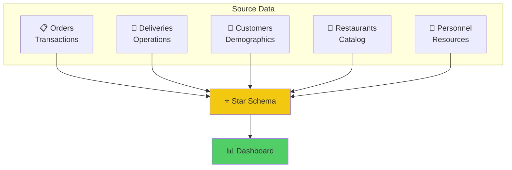

<div align="center">

# 🍕 ZestyEats - Food Delivery Analytics Dashboard

### End-to-End Power BI Solution for Food Delivery Operations Intelligence


<br>

### 🔗 [**View Live Dashboard →**](https://app.powerbi.com/groups/5c9dc702-7a40-4b6f-bb78-cacd8b8b75fe/reports/3fddc3de-9054-41e3-8b36-ff2add5ddaae/97b0d558e989029bcba1?experience=power-bi)

<br>

[📊 Dashboards](#-dashboard-pages) • [💡 Key Insights](#-key-insights) • [🛠️ Technical Details](#️-technical-skills-demonstrated) • [🚀 Get Started](#-quick-start)

</div>

---

## 📌 Executive Summary

A comprehensive **Food Delivery Analytics Platform** that transforms raw operational data into actionable business intelligence through interactive dashboards, enabling data-driven decisions for sales optimization, delivery performance, and customer engagement.

<div align="center">

| Metric | Value |
|:------:|:------|
| 📊 **3 Dashboards** | KPIs, Analytics, Performance |
| 📈 **15+ Visualizations** | Donut, Bar, Scatter, Treemap |
| 🔢 **12+ DAX Measures** | Custom calculated metrics |
| 📋 **5 Data Tables** | Orders, Deliveries, Customers, Restaurants, Personnel |

</div>

---

## ✨ What This Project Does

```
┌─────────────────────────────────────────────────────────────────────────────────┐
│                                                                                 │
│  📊 REAL-TIME KPIs         │  👥 CUSTOMER INSIGHTS    │  🚚 OPERATIONS         │
│  ─────────────────         │  ──────────────────      │  ──────────────        │
│  • Sales tracking          │  • Demographics          │  • Delivery times      │
│  • Revenue analysis        │  • Ordering patterns     │  • Traffic impact      │
│  • Performance metrics     │  • Segment analysis      │  • Personnel efficiency│
│                                                                                 │
└─────────────────────────────────────────────────────────────────────────────────┘
```

---

## 📊 Dashboard Pages

### 📌 Page 1: KPIs Dashboard
> *Executive summary with key business metrics*

| Component | Type | Purpose |
|-----------|------|---------|
| **Revenue KPIs** | Cards | Total Sales, Avg Order Value |
| **Order Metrics** | Cards | Total Orders, Completion Rate |
| **Time Analysis** | Charts | Daily/Weekly/Monthly trends |
| **Category Performance** | Visuals | Revenue by food category |

---

### 📌 Page 2: Analytics Dashboard
> *Customer demographics and sales trend analysis*

| Component | Type | Purpose |
|-----------|------|---------|
| **Age Segmentation** | Donut Chart | Customer age group distribution |
| **Gender Analysis** | Pie Chart | Male/Female ordering patterns |
| **Revenue by Demographics** | Bar Charts | 80% revenue driver analysis |
| **Order Value Distribution** | Histogram | Low/Medium/High categorization |

---

### 📌 Page 3: Performance Dashboard
> *Delivery efficiency and operational insights*

| Component | Type | Purpose |
|-----------|------|---------|
| **On-Time Delivery** | KPI Card | 30-minute benchmark tracking |
| **Traffic Impact** | Scatter Plot | Delivery time vs traffic conditions |
| **Personnel Efficiency** | Bar Chart | Performance by delivery person |
| **Vehicle Analysis** | Treemap | Efficiency by vehicle type |

---

## 🎯 Advanced Analytics Features

<table>
<tr>
<td width="50%">

**🔄 Dynamic Filtering**
- Cross-filtering across all visuals
- Interactive slicers
- Drill-down capabilities

</td>
<td width="50%">

**📊 Smart Categorization**
- Order value tiers (Low/Medium/High)
- Age group segmentation
- Risk category classification

</td>
</tr>
<tr>
<td>

**⏱️ Performance Tracking**
- On-time delivery (30-min benchmark)
- Traffic condition analysis
- Personnel efficiency scores

</td>
<td>

**📈 Context Switching**
- Revenue % with `ALL()` functions
- Dynamic measure calculations
- Comparative analysis

</td>
</tr>
</table>

---

## 🛠️ Technical Skills Demonstrated

### 🔧 Data Engineering
```
✅ Multi-table data integration (5 tables)
✅ Complex Power Query transformations
✅ Conditional column creation
✅ Data cleansing & standardization
```

### 📐 Data Modeling
```
✅ Star schema design
✅ Proper table relationships
✅ Advanced DAX calculations
✅ Context manipulation with ALL()
```

### 🎨 Visualization
```
✅ 10+ interactive chart types
✅ Professional dashboard design
✅ Cross-filtering implementation
✅ Drill-down hierarchies
```

---

## 🗂️ Data Architecture



### Table Relationships
| From | To | Type |
|------|-----|------|
| Orders | Deliveries | One-to-One |
| Orders | Customers | Many-to-One |
| Orders | Restaurants | Many-to-One |
| Deliveries | Personnel | Many-to-One |

---

## 💡 Key Insights

<div align="center">

| # | Finding | Business Impact |
|:-:|---------|-----------------|
| 1️⃣ | Delivery patterns vary significantly by **traffic conditions** | Optimize routing & scheduling |
| 2️⃣ | **80% of revenue** driven by specific customer demographics | Target marketing campaigns |
| 3️⃣ | Order value distribution shows **clear category preferences** | Menu optimization |
| 4️⃣ | **Vehicle type** impacts delivery efficiency | Fleet management decisions |
| 5️⃣ | **On-time delivery** correlates with customer retention | SLA monitoring |

</div>

---

## 🚀 Business Value

```
┌────────────────────────────────────────────────────────────────────┐
│                                                                    │
│   📈 AUTOMATED REPORTING     Replaced manual Excel analysis        │
│   ⏱️ REAL-TIME MONITORING    Live KPIs for operations team        │
│   🎯 DATA-DRIVEN DECISIONS   Strategic insights for leadership    │
│   💰 REVENUE OPTIMIZATION    Category & segment analysis          │
│                                                                    │
└────────────────────────────────────────────────────────────────────┘
```

---

## 📈 Results

<div align="center">

| Deliverable | Count |
|:-----------:|:-----:|
| 🎨 Production-Ready Dashboards | **3** |
| 📊 Interactive Visualizations | **15+** |
| 🔢 Calculated DAX Measures | **12+** |
| 🔍 Filter Dimensions | **Multiple** |
| 👔 Executive Presentation | **Ready** |

</div>

---

## 🚀 Quick Start

### Prerequisites
- [Power BI Desktop](https://powerbi.microsoft.com/en-us/downloads/) (Free)

### Option 1: View Live Dashboard
🔗 **[Click here to view the live dashboard](https://app.powerbi.com/groups/5c9dc702-7a40-4b6f-bb78-cacd8b8b75fe/reports/3fddc3de-9054-41e3-8b36-ff2add5ddaae/97b0d558e989029bcba1?experience=power-bi)**

### Option 2: Download & Explore
```bash
# 1. Clone this repository
git clone https://github.com/rahulx2001/ZestyEatsAnalysis.git

# 2. Open the Power BI file
# Navigate to folder and open: ZestyEatsPowerBi.pbix

# 3. Explore the dashboards!
# Use slicers to filter and interact with data
```

---

## 📂 Project Structure

```
ZestyEatsAnalysis/
├── 📊 ZestyEatsPowerBi.pbix    # Main dashboard file
└── 📖 README.md                 # Documentation
```

---

## 🛠️ Technical Stack

<div align="center">

| Tool | Purpose |
|:----:|---------|
|  | Dashboard Development |
|  | Calculated Measures |
|  | Data Transformation |
|  | Source Data |

</div>

---

## 🤝 Connect With Me

<div align="center">

[](https://linkedin.com/in/rahulx2001)
[](https://github.com/rahulx2001)
[](https://rahulkumarsingh-portfolio.vercel.app)

</div>

---

<div align="center">

**⭐ If you found this project useful, please consider giving it a star!**

*Built with 💜 by [Rahul Kumar Singh](https://github.com/rahulx2001)*

</div>
